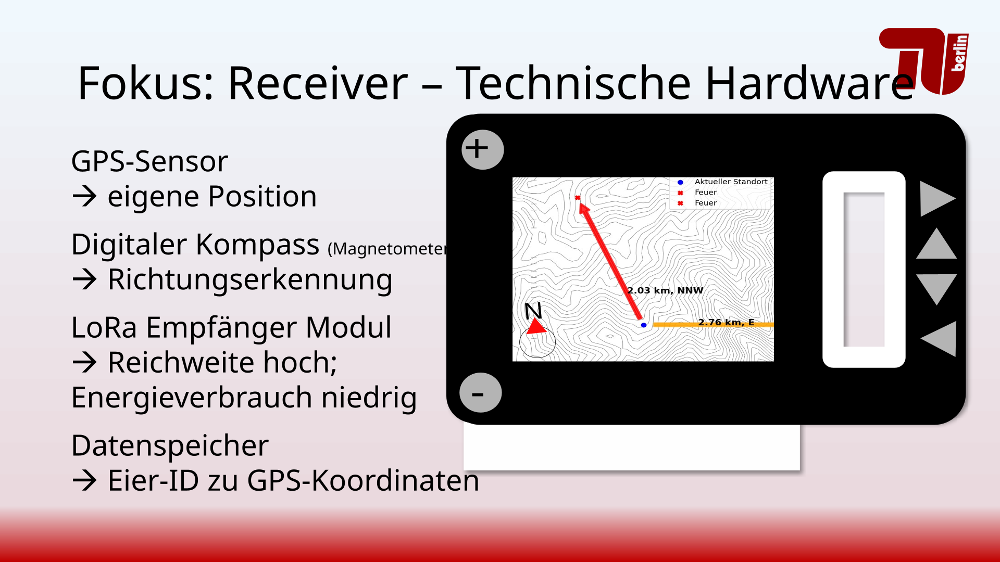

# Welcome to Fire Detection Egg!  

The common wireless infrastructure requires cell towers which pose impractical or even hazardous in vast forest areas. This results in greatly reduced options when detecting forest fires in real-time and being able to efficiently navigate towards or away from them as firefighters or hikers respectively. 

Therefore, a device for navigation as the receiving counterpart to the Fire Detection Egg is proposed in this work.

by **Rebecca Pampu, 22.07.2025**

## Documentation 

Presentation slides (German): [here](docs/Orientierung%20bei%20Waldbrand.pdf)

Documentation (English): [here](docs/Documentation_en_v2.pdf)

Video of simulation in action: [here](docs/videos/Screen_Recording.mp4)

## Hardware 

Not yet implemented, but a plan on how a receiver device might be realised can be found:  
(German): [here](hardware/Receiver_Device_de.pdf)  
(English): [here](hardware/Receiver_Device_en.pdf)

## Links 

[Our website lifolab](https://www.lifolab.de)

[Fachgebiet Nachrichtenübertragung an der Technischen Universität Berlin](https://www.tu.berlin/nue)
